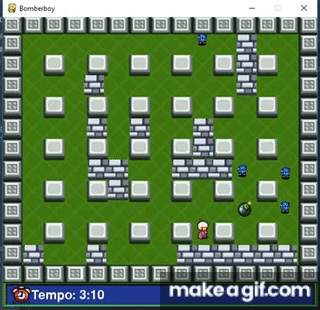

# Bomberboy
Trabalho final da disciplina Programação de Computadores no curso TADS 2018.1, IFRN-CNAT.

## Descrição
Game baseado no jogo bomberman com mecânicas similares

## Autores 
Judson Alexsander da Silva<br>
Pedro Beethoven da Costa

## Instalação 
Primeiramente deve-se clonar o repositório:
```
$ git clone https://github.com/PedroCosta8/Bomberboy.git
```
Depois para iniciar o Bomberboy é necessário instalar o `pygame`:

```
$ python3 -m pip install -U pygame --user
```
Para executar o game:
```
$ cd Bomberboy/bomberboy-v2 && python3 bomberboy_v2.py
```

## Gameplay
<p align='center'>
  
</p>

## Comandos
<kbd>↑</kbd> Movimenta o personagem para cima<br>
<kbd>↓</kbd> Movimenta o personagem para baixo<br>
<kbd>→</kbd> Movimenta o personagem para direita<br>
<kbd>←</kbd> Movimenta o personagem para esquerda<br>
<kbd>SPACE</kbd> Coloca a bomba<br>
